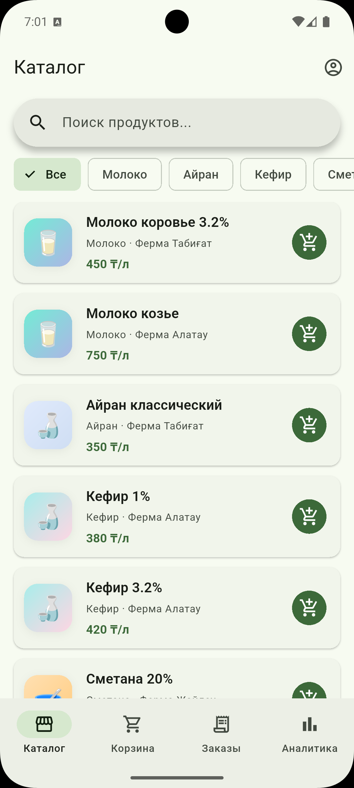
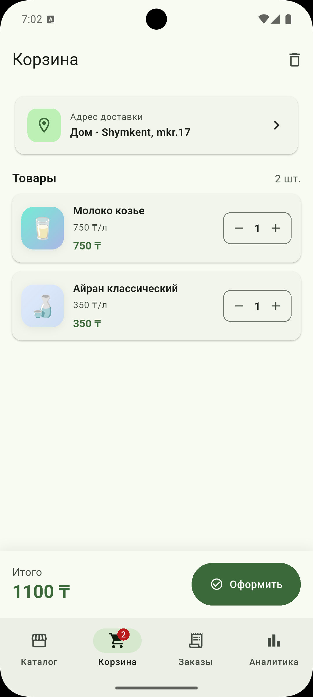
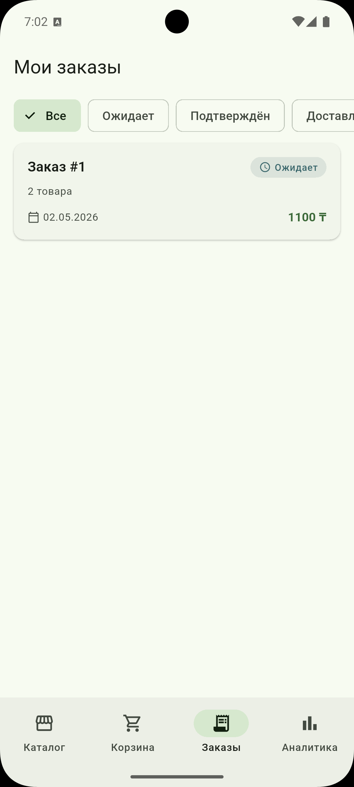
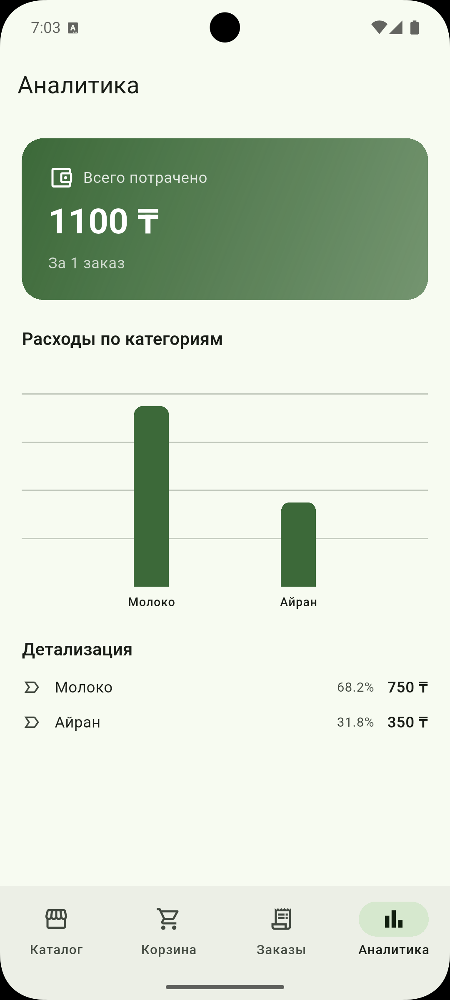

# MolokoAyran 🥛

Мобильное приложение для заказа натуральных молочных продуктов от фермеров.

## Скриншоты

| Каталог | Корзина | Заказы | Аналитика |
|---------|---------|--------|-----------|
|  |  |  |  |

##  Стек технологий

- **Flutter** + **Material 3**
- **flutter_bloc** — управление состоянием
- **go_router** — навигация
- **Drift (SQLite)** — локальная БД
- **fl_chart** — графики
- **Dio** — HTTP-клиент для онлайн-авторизации
- **shared_preferences** — сессия и настройки
- **mocktail** + **bloc_test** — unit-тесты

## Авторизация

Авторизация выполняется **онлайн через REST API**. Используется `Dio` как HTTP-клиент и публичный mock-сервис `reqres.in` для демонстрации онлайн-стека.

### Архитектура авторизации

```
LoginScreen → AuthBloc → LoginUseCase → AuthRepository
                                              │
                                    ┌─────────┴─────────┐
                                    ↓                    ↓
                          AuthRemoteDatasource    AuthLocalDatasource
                          (Dio + reqres.in)      (Drift + SharedPrefs)
```

- **Online-first**: при логине/регистрации сначала запрашивается токен с сервера
- **Локальный fallback**: если сервер недоступен — проверка через локальную БД
- **Сессия**: токен и user_id сохраняются в SharedPreferences

### Замена backend

Архитектура построена через Repository pattern — переход на Firebase Authentication, Supabase или собственный API сводится к замене единственного класса `AuthRemoteDatasource`. Бизнес-логика, BLoC и UI не затрагиваются.

## Возможности

### Авторизация (онлайн)
- Регистрация и вход через REST API (Dio)
- Сохранение токена и сессии между запусками
- Fallback на локальную проверку для офлайн-сценариев

### Каталог продуктов
- 14 продуктов от фермеров с категориями
- Поиск по названию · фильтр по категории
- Pull-to-refresh · Skeleton loading

### Корзина
- Добавление товаров с выбором количества
- Изменение количества в корзине
- **Корзина сохраняется в SQLite** — пережёёт закрытие приложения
- У каждого пользователя своя корзина

### Заказы
- Оформление с выбором адреса доставки
- Фильтр по статусу (Ожидает / Подтверждён / Доставлен / Отменён)
- Экран деталей заказа
- Отмена и удаление

### Адреса доставки
- CRUD адресов · адрес по умолчанию · выбор при оформлении

### Аналитика (fl_chart)
- Общая сумма расходов
- BarChart по категориям с детализацией в %

### Профиль
- Email, статистика заказов
- Управление адресами
- Тёмная / светлая / системная тема
- Выход из аккаунта

### Дополнительно
- Онбординг при первом запуске (3 экрана)
- Светлая и тёмная темы с сохранением выбора
- Полный офлайн-режим для данных приложения

## Архитектура

Проект построен по принципам **Clean Architecture**:

```
lib/
├── core/                  # Темы, константы, утилиты, общие виджеты
├── domain/                # Бизнес-логика, не зависит от Flutter
│   ├── entities/          # User, Product, Order, Address
│   ├── repositories/      # Абстракции
│   └── usecases/          # CreateOrderUseCase и т.д.
├── data/                  # Реализация работы с БД и API
│   ├── models/            # Drift таблицы
│   ├── datasources/       # AuthRemoteDatasource, AuthLocalDatasource, Drift
│   └── repositories/      # Реализации
└── presentation/          # UI слой
    ├── blocs/             # 6 BLoC: Auth, Product, Order, Cart, Address, Theme
    ├── screens/           # 13 экранов
    └── widgets/           # ProductImage, EmptyState, ProductSkeleton
```

### База данных (5 таблиц, schema v6)

| Таблица | Назначение |
|---------|------------|
| Users | Локальный кэш пользователей |
| Products | Каталог продуктов |
| Orders | История заказов с адресом |
| CartItems | Корзина (отдельно для каждого пользователя) |
| Addresses | Адреса доставки |

##  Запуск

```bash
flutter pub get
dart run build_runner build --delete-conflicting-outputs
flutter run
```

##  Тесты

```bash
flutter test
```

24 unit-теста покрывают CartBloc, OrderBloc и use cases.

## Сборка APK

```bash
flutter build apk --debug
```

##  Автор

**Бисултан Куандыков** 